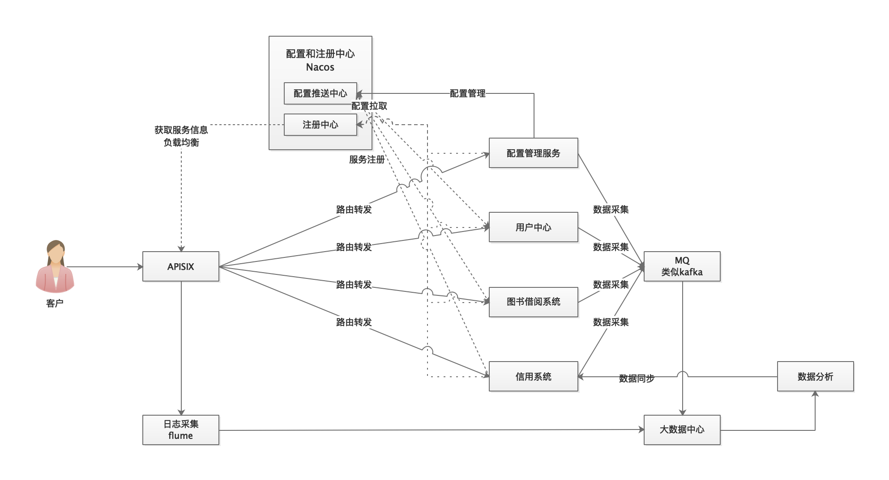

## 整体简要架构



### 一、配置管理系统
#### 1、Springboot设置配置信息

```java
@Configuration
@ConfigurationProperties(prefix = "config")
@Data
public class ConfigValidationProperties {
    private Map<String, ConfigInfo> configMap;
}

@Data
public class ConfigInfo {
    //字段匹配规则
    private String pattern;
    //未匹配提示消息
    private String patternMessage;
    //字段最小长度
    private Integer min = 1;
    //最小长度提示消息
    private String minMessage;
    // 字段最小长度
    private Integer max = 200;
    //最大长度提示消息
    private String maxMessage;
}
```
#### 2、配置中心配置
check.yml

```props
config:
  configMap:
    passworkCheck:
      min: 6
      max: 100
      minMessage: 小于6位字符，请检查
      maxMessage: 大于100位字符，请检查
      pattern: A-Z0-9a-z
      patternMessage: 不匹配正则表达式
```


#### 3、自定义校验

```java
public class ConfigCheckValidator implements ConstraintValidator<ConfigInfoValidation, String> {

    @Autowired
    private ConfigValidationProperties properties;

    private ConfigInfoValidation configCheckValidator;

    @Override
    public void initialize(ConfigInfoValidation configInfoValidation) {
        this.configCheckValidator = configInfoValidation;
    }

    @Override
    public boolean isValid(String value, ConstraintValidatorContext context) {
        String key = configCheckValidator.key();
        ConfigInfo configInfo = properties.getConfigMap().get(key);
        if (configInfo == null) {
            return false;
        }
        ....
        return true;
    }
}
```

#### 4、使用

```java
@GetMapping
public void testCheck(@ConfigInfoValidation(key = "passworkCheck", message = "配置为找到") 
                      String password) {
}
```

### 二、统一用户体系
#### API安全

##### 2.1. 接口加签（防篡改）

防篡改：保护数据在传输过程中的完整性，必须确认不会在数据传输过程中被截获和篡改。

数据防篡改的主要手段是针对数据进行客户端加签，在服务端接收数据时验证加签数据是否与签名一致。加签的过程实质上是发送端针对待发送的原始数据进行一定的处理（例如字符串去空格、字段排序、数据加密）后针对数据加签生成签名摘要数据，这部分摘要数据一般不会参与加密。接收端在收到数据之后，先将签名摘要数据和加密数据取出来，然后解密已加密的数据块得到原始数据，最后像发送端一样进行处理，生成签名摘要数据。 如果生成的摘要数据与发送端传送过来的一致，则表示数据没被篡改过，否则表示数据在传输过程中被篡改。

下面讲解对防篡改的数据进行签名和验签的过程

MD5加签：

（1）对原始数据去空格，进行参数字段排序（升序或降序）和拼接。

（2）将原始数据（待签名内容）根据参数字段名称进行排序，可以保证加签、验签的双方待验证参数内容的一致性。例如：排序升序规则按照第一个字符的ASCII码值递增排序，如果遇到相同的字符，则依据第2个字符排递增序，以此类推。将排序后的参数拼接成“参数=参数值”的格式，并且把这些参数使用‘“&”字符连接起来。

（3）生成摘要数据，常用的摘要算法有MD5、SHA-1等。

MD5验签：

（1）参数排序。将收到的参数内容（key=value字典）根据参数名称进行排序，其排序规则与签名方保持一致，对参数字符串去空格和拼接，其拼接方式与签名方保持一致，生成待生成摘要的原参数字符串。

（2）生成摘要数据。使用相同的摘要算法（MD5）计算得到验签方的摘要值。

（3）摘要数据对比。如果签名方的摘要数值等于验签方计算出来的摘要值，则表示验签成功，否则验签失败。

设备侧APP计算MD5签名：

    sig=MD5("param1=APPID&param2=时间戳&param3=随机字符串&param4=请求参数&param5=APPKEY")

手机侧APP计算MD5签名：

    sig=MD5("param1=token&param2=时间戳&param3=随机字符串&param4=请求参数&param5=XXX")
##### 2.2. 接口鉴权（防越权）

设备侧APP API接口鉴权：API Key＋API Secret

    服务器给每个客户端生成一对Key/Secret，并告知客户端，Key和Secret之间没有任何关系，相互之间不能推算。
    客户端发起请求时，会把包括API Key在内的所有请求参数排序，然后跟API Secret一起做hash生成一个sing参数，服务器只需要按照约定的规则做一次签名计算，然后和请求的签名作比较，如果一致，则验证通过。

手机侧APP  API接口鉴权：token

1、用户发起登录请求；

2、服务器使用私钥创建一个jwt字符串，作为token；

3、服务器将这个token返回给客户端；

4、在后续请求中，token作为请求头的内容，发给服务端；

5、服务端拿到token之后进行解密，正确解密表示此次请求合法，验证通过；解密失败说明token无效或者已过期

6、返回响应的资源给浏览器。

##### 2.3 对api进行限流降级

### 三、信用体系数据采集
1、对于nginx/apisix使用flume进行日志数据采集，对于本身有大数据平台的。我们对接原有的大数据平台。
